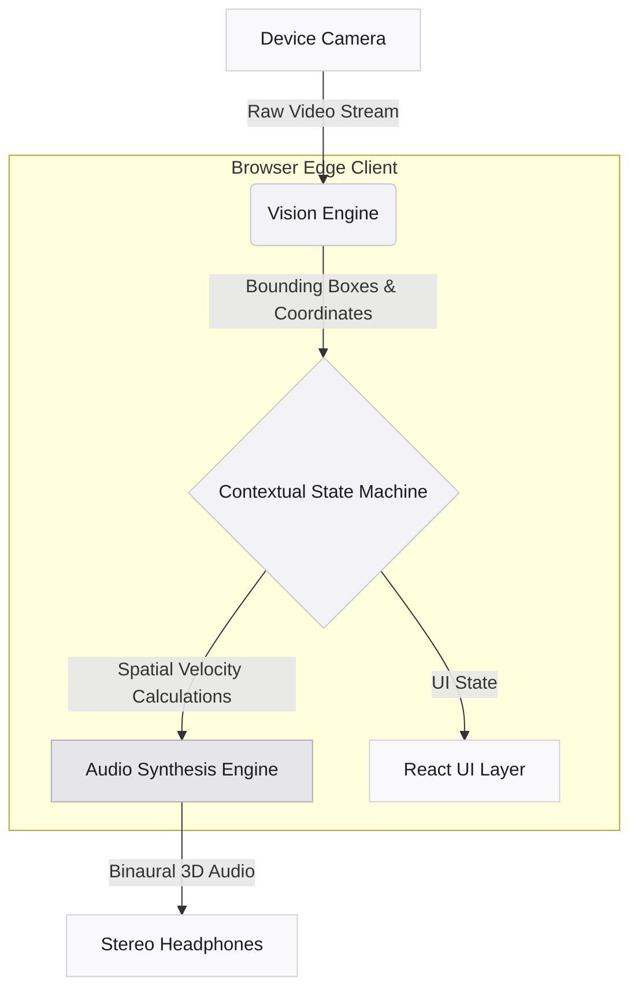

# Saartheye

**The guide that sees for you.**

Saartheye is an advanced, on-device navigation companion designed for the visually impaired. It operates entirely within the browser, delivering zero-latency real-time vision and 3D spatial audio echolocation. By bypassing the cloud entirely, it ensures privacy, speed, and reliability when it matters most.

[**View Live Production**](https://saartheye-ai.vercel.app/)

---

## Architecture

Saartheye represents a paradigm shift in accessibility technology. Leveraging raw silicon sensing and edge AI, it processes environmental data directly on your device. No servers, no network latency—just direct, real-time spatial awareness.



### 1. Silicon Sensing
Camera streams are piped directly into native device memory. Driven by a highly optimized YOLO-based model via TensorFlow.js, it processes data at the edge. Zero frame drops. Zero network calls.

### 2. Spatial Echolocation
We translate 2D bounding boxes into a 3D binaural landscape. By mathematically mapping pixel coordinates to a dynamic Web Audio spatial panner network, Saartheye paints the world in sound. Obstacle proximity alters frequency pitch, while lateral placement translates seamlessly to stereo panning.

### 3. Spatial Velocity Vectoring
Saartheye calculates instantaneous bounding box growth to determine spatial velocity. Rapidly enlarging objects trigger collision trajectories, while stationary objects fade into ambient background acoustics.

---

## API & Internal Schema

Saartheye's architecture relies on internal data contracts between the Vision Engine and the Audio Synthesis Engine, operating entirely in-memory.

### Inference Pipeline

The `VisionHUD` component processes frames and outputs a standardized object schema:

```typescript
interface DetectedObject {
  class: string;          // e.g., 'person', 'car', 'chair'
  score: number;          // Confidence threshold (0.0 to 1.0)
  bbox: [
    number,               // x-coordinate (top-left)
    number,               // y-coordinate (top-left)
    number,               // width
    number                // height
  ];
  spatialVelocity?: number; // Calculated dz/dt for collision proximity
}
```

### Audio Synthesis Mapping

The `spatialAudio.js` utility consumes the `DetectedObject` schema and maps coordinates to the Web Audio API's `PannerNode`:

*   **X-Axis (Pan):** Mapped from the object's horizontal position (`bbox[0]`). Translates to left/right binaural panning.
*   **Z-Axis (Proximity):** Mapped from the object's area (`bbox[2] * bbox[3]`). Translates to pitch/frequency (larger objects = lower, closer frequency).
*   **Velocity:** Aggressiveness of the audio pulse is modulated by `spatialVelocity`.

---

## Contextual Modes

Saartheye features an intelligent state-machine that autonomously adapts to your environment.

*   **Outdoor Mode:** High-sensitivity navigation. Aggressive alerting on all rapidly approaching objects and nearby collision hazards.
*   **Social Mode:** Smart suppression. Detects stationary conversation partners and suppresses aggressive alarms, emitting soft ambient pings to maintain gentle spatial awareness.

---

## Local Setup Guide

Saartheye is engineered for performance on the modern web and requires no complex local dependencies beyond Node.js.

### Prerequisites
*   Node.js (v18 or newer recommended)
*   A modern web browser (Safari, Chrome, or Firefox)
*   Stereo headphones (Required for spatial echolocation)

### Installation

1. Clone the repository and navigate to the project directory:
   ```bash
   git clone https://github.com/MaybeSomeone-arc18/saartheye-ai.git
   cd saartheye-ai
   ```

2. Install dependencies:
   ```bash
   npm install
   ```

3. Start the local edge server:
   ```bash
   npm run dev
   ```

4. Open the provided localhost URL in your browser. 
   *Note: Camera permissions must be granted for the Vision Engine to initialize.*

---

*Designed and engineered for true spatial independence.*
